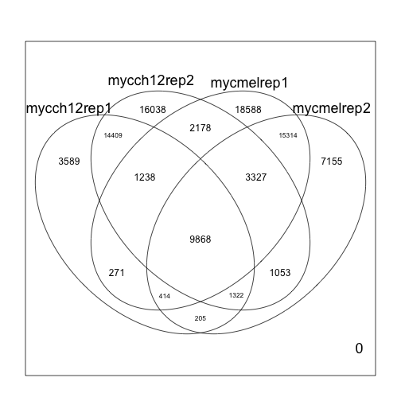
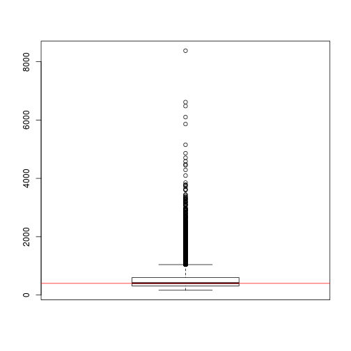

Differential Binding
========================================================
author: MRC Clinical Sciences Centre
width: 1440
height: 1100
autosize: true
font-import: <link href='http://fonts.googleapis.com/css?family=Slabo+27px' rel='stylesheet' type='text/css'>
font-family: 'Slabo 27px', serif;
css:style.css

Intro to differential binding
========================================================

We may expect binding to occur in differing conditions.
There are two main ways of looking for differing peaks
-Occupancy analysis 
-Differential binding analysis

Here we will briefly discuss both

loading the libraries
========================================================


```r
library(ChIPQC)
library(soGGi)
library(DESeq2)
library(GenomicRanges)
library(Rsubread)
```


Reading in a peak from Macs
========================================================
Lets load a single set of peaks fromn Macs calls for Myc in mel and ch12 cell lines.

```
GRanges object with 33498 ranges and 7 metadata columns:
          seqnames             ranges strand   |        ID     Score
             <Rle>          <IRanges>  <Rle>   | <integer> <integer>
      [1]        1 [4480665, 4480849]      *   |       185   4480769
      [2]        1 [4661593, 4661934]      *   |       342   4661762
      [3]        1 [4774202, 4774393]      *   |       192   4774293
      [4]        1 [4775399, 4775792]      *   |       394   4775544
      [5]        1 [4775957, 4776125]      *   |       169   4776021
      ...      ...                ...    ... ...       ...       ...
  [33494]        Y [ 234019,  234250]      *   |       232    234139
  [33495]        Y [ 307766,  308084]      *   |       319    307929
  [33496]        Y [ 582005,  582258]      *   |       254    582128
  [33497]        Y [ 622964,  623320]      *   |       357    623149
  [33498]        Y [2721204, 2721372]      *   |       169   2721341
            Strand X.log10.pvalue. fold_enrichment X.log10.qvalue.
          <factor>       <numeric>       <numeric>       <numeric>
      [1]        *         6.89435         4.45956         4.21774
      [2]        *        30.49564        11.09288        26.75324
      [3]        *         5.83769         4.13574         3.27058
      [4]        *        17.08627         7.31683        13.80057
      [5]        *         5.66523         3.17407         3.10884
      ...      ...             ...             ...             ...
  [33494]        *        12.05558         5.10991         9.01059
  [33495]        *        43.34924        18.80093        39.29480
  [33496]        *         7.92002         5.08412         5.15692
  [33497]        *        15.31314         7.89867        12.10620
  [33498]        *         9.97111         6.14918         7.05846
                            name
                        <factor>
      [1]     mycch12rep1_peak_1
      [2]     mycch12rep1_peak_2
      [3]     mycch12rep1_peak_3
      [4]     mycch12rep1_peak_4
      [5]     mycch12rep1_peak_5
      ...                    ...
  [33494] mycch12rep1_peak_33494
  [33495] mycch12rep1_peak_33495
  [33496] mycch12rep1_peak_33496
  [33497] mycch12rep1_peak_33497
  [33498] mycch12rep1_peak_33498
  -------
  seqinfo: 22 sequences from an unspecified genome; no seqlengths
```

```r
macsPeaks <- dir("/home/ubuntu/chipseqcourseNew/MacsPeaks/",full.names=T)
singlePeakSet <- ChIPQC:::GetGRanges(macsPeaks[1],sep="\t",simplify=T)
singlePeakSet
```

Getting a consensus set
========================================================
To get a consensus set first we "flatten" all peak sets to a single set of peaks occuring in any conditions.

Overlapping peaks are merged


```r
listOfPeaks <- GRangesList(lapply(macsPeaks,function(x)ChIPQC:::GetGRanges(x,sep="\t",simplify=T)))
flattenedPeaks <- reduce(unlist(listOfPeaks))
```

The next step would be to identify when samples shared peaks
========================================================

```r
matOfOverlaps <- sapply(listOfPeaks,function(x)
(flattenedPeaks %over% x)+0
)

colnames(matOfOverlaps) <- basename(gsub("_peaks\\.xls","",macsPeaks))


elementMetadata(flattenedPeaks) <- matOfOverlaps

flattenedPeaks[1:2,]
```

```
GRanges object with 2 ranges and 4 metadata columns:
      seqnames             ranges strand | mycch12rep1 mycch12rep2
         <Rle>          <IRanges>  <Rle> |   <numeric>   <numeric>
  [1]        1 [3049670, 3049833]      * |           0           0
  [2]        1 [3435991, 3436154]      * |           0           0
      mycmelrep1 mycmelrep2
       <numeric>  <numeric>
  [1]          1          0
  [2]          1          0
  -------
  seqinfo: 22 sequences from an unspecified genome; no seqlengths
```

========================================================
We can get a quick idea about where overlaps occur using vennCounts


```r
limma:::vennCounts(as.data.frame(elementMetadata(flattenedPeaks)))
```

```
   mycch12rep1 mycch12rep2 mycmelrep1 mycmelrep2 Counts
1            0           0          0          0      0
2            0           0          0          1   7155
3            0           0          1          0  18588
4            0           0          1          1  15314
5            0           1          0          0  16038
6            0           1          0          1   1053
7            0           1          1          0   2178
8            0           1          1          1   3327
9            1           0          0          0   3589
10           1           0          0          1    205
11           1           0          1          0    271
12           1           0          1          1    414
13           1           1          0          0  14409
14           1           1          0          1   1322
15           1           1          1          0   1238
16           1           1          1          1   9868
attr(,"class")
[1] "VennCounts"
```


========================================================
Or we can view as VennDiagram


```r
limma:::vennDiagram(as.data.frame(elementMetadata(flattenedPeaks)))
```

 


========================================================
Now we can identify common peaks


```r
mych12Peaks <- flattenedPeaks[elementMetadata(flattenedPeaks)$mycch12rep1 + 
                 elementMetadata(flattenedPeaks)$mycch12rep2 == 2]
mycMelPeaks <- flattenedPeaks[elementMetadata(flattenedPeaks)$mycmelrep1 +                  elementMetadata(flattenedPeaks)$mycmelrep2 == 2]
```

========================================================
And some unique peaks 

```r
mycMelPeaks_Only <- flattenedPeaks[elementMetadata(flattenedPeaks)$mycmelrep1 +                  elementMetadata(flattenedPeaks)$mycmelrep2 == 2 &
elementMetadata(flattenedPeaks)$mycch12rep1 + 
                 elementMetadata(flattenedPeaks)$mycch12rep2 == 0]

mycMelPeaks_Only[1,]
```

```
GRanges object with 1 range and 4 metadata columns:
      seqnames             ranges strand | mycch12rep1 mycch12rep2
         <Rle>          <IRanges>  <Rle> |   <numeric>   <numeric>
  [1]        1 [7606348, 7606524]      * |           0           0
      mycmelrep1 mycmelrep2
       <numeric>  <numeric>
  [1]          1          1
  -------
  seqinfo: 22 sequences from an unspecified genome; no seqlengths
```

We can check the Venn to see our numbers add up

Simple Differential binding
========================================================
Now we take high confidence peaks in either condition.


```r
highConfidence_Only <- flattenedPeaks[elementMetadata(flattenedPeaks)$mycmelrep1 +                  elementMetadata(flattenedPeaks)$mycmelrep2 == 2 |
elementMetadata(flattenedPeaks)$mycch12rep1 + 
                 elementMetadata(flattenedPeaks)$mycch12rep2 == 2]
```

Simple Differential binding
========================================================
Now we can look to see if we need resizing.

```r
boxplot(width(highConfidence_Only))
abline(h=400,col="red")
```

 
The majority of peaks are around 400 so we will resize all peaks to this for ease here

Simple Differential binding
========================================================
Now we can resize to a sensible size

```r
PeaksToCount <- resize(highConfidence_Only,width = 400,fix = "center")
PeaksToCount[1:2,]
```

```
GRanges object with 2 ranges and 4 metadata columns:
      seqnames             ranges strand | mycch12rep1 mycch12rep2
         <Rle>          <IRanges>  <Rle> |   <numeric>   <numeric>
  [1]        1 [4661451, 4661850]      * |           1           1
  [2]        1 [4775531, 4775930]      * |           1           1
      mycmelrep1 mycmelrep2
       <numeric>  <numeric>
  [1]          0          0
  [2]          1          1
  -------
  seqinfo: 22 sequences from an unspecified genome; no seqlengths
```

Simple Differential binding - Counting
========================================================
Now we can count the reads from each sample which land in our high confidence peaks

First we will count one file with featureCounts. The first step is to convert our files to SAF format.


```
 [1] 45 56 51 20 27 27 25 15 46 48
```


```r
Bams <- dir("/home/ubuntu//chipseqcourseData/sortedbams/",pattern="*sorted\\..*bam$",full.names=T)
simplePeaksToCount <- ChIPQC:::GetGRanges(PeaksToCount,simple=T,simplify=T)


toCount <- data.frame(GeneID = paste0("ID",seq(1,length(simplePeaksToCount))),
                      Chr=seqnames(simplePeaksToCount),Start=start(simplePeaksToCount),
                      End=end(simplePeaksToCount),Strand="-")

out  <- capture.output(myCountTable <- featureCounts(Bams[1],annot.ext = toCount,nthreads=4))

myCountTable$counts[1:10]
```


Simple Differential binding - Counting all files
========================================================
Now we can use a lapply to count all samples in high confidence peaks


```r
out <- capture.output(
  myCountTableList <- lapply(Bams,function(x)
                               featureCounts(x,annot.ext = toCount,nthreads=4))
)
```

You could have a look at **out** to compare mapping ratres between input and ChIP 

Simple Differential binding - Stitching count files together
========================================================
Now we can use a lapply to count all samples in high confidence peaks


```r
countTable <- sapply(myCountTableList,function(x)x$counts)
rownames(countTable) <- paste0(toCount[,1],"-",toCount[,2],";",toCount[,3],"-",toCount[,4])
colnames(countTable) <- c("ch12myc","ch12myc","ch12input","melmyc","melmyc","meinput")
```


Simple Differential binding - A simple DEseq2 DE analysis
========================================================
Here we set up a DEseq2 object much as you would for RNAseq.
We define the conditions in **colData** as CellLines for Mel and ch12

This will identify any significant differennces in Myc binding between the cell lines.


```r
library("DESeq2")

colData <- data.frame(SampleName=colnames(countTable[,-c(3,6)]),CellLine=c("ch12","ch12","mel","mel"))
dds <- DESeqDataSetFromMatrix(countData = countTable[,-c(3,6)],
                              colData = colData,
                              design = ~ CellLine)

dds <- DESeq(dds)
testcellline <- results(dds, contrast=c("CellLine","ch12","mel"))
```

Simple Differential binding - The DE
========================================================
Here we can see our top changing peaks.

```r
testcellline <- testcellline[order(testcellline$pvalue),]
testcellline <- as.data.frame(testcellline)
testcellline[1:3,]
```

```
                            baseMean log2FoldChange     lfcSE      stat
ID978-1;87500888-87501287   398.1717       5.492110 0.3073727  17.86792
ID5406-11;3093141-3093540   623.0347      -3.132885 0.1779477 -17.60565
ID30091-4;45966212-45966611 386.9550      -5.950852 0.3480818 -17.09613
                                  pvalue         padj
ID978-1;87500888-87501287   2.096682e-71 9.622093e-67
ID5406-11;3093141-3093540   2.229251e-69 5.115239e-65
ID30091-4;45966212-45966611 1.585952e-65 2.426084e-61
```

Simple Differential binding - Creating the DE GRanges
========================================================
Now we can make GRanges for ease later

```r
resultsMat <- matrix(unlist(strsplit(rownames(testcellline),"-")),byrow=T,ncol=3)
resultMatPart2 <- matrix(unlist(strsplit(resultsMat[,2],";")),byrow=T,ncol=2)
DEasGRanges <- GRanges(seqnames=resultMatPart2[,1],IRanges(as.numeric(as.vector(resultMatPart2[,2])),as.numeric(as.vector(resultsMat[,3]))),elementMetadata=testcellline)
colnames(elementMetadata(DEasGRanges)) <- gsub("elementMetadata","",colnames(elementMetadata(DEasGRanges)))
DEasGRanges[1:5,]
```

```
GRanges object with 5 ranges and 6 metadata columns:
                              seqnames               ranges strand |
                                 <Rle>            <IRanges>  <Rle> |
    ID978-1;87500888-87501287        1 [87500888, 87501287]      * |
    ID5406-11;3093141-3093540       11 [ 3093141,  3093540]      * |
  ID30091-4;45966212-45966611        4 [45966212, 45966611]      * |
  ID7644-11;78943225-78943624       11 [78943225, 78943624]      * |
  ID9828-12;21341806-21342205       12 [21341806, 21342205]      * |
                                     .baseMean   .log2FoldChange
                                     <numeric>         <numeric>
    ID978-1;87500888-87501287 398.171664149091  5.49211025039039
    ID5406-11;3093141-3093540 623.034744317291 -3.13288528522113
  ID30091-4;45966212-45966611 386.955035821693 -5.95085205061831
  ID7644-11;78943225-78943624 326.451589484206   5.9845753340433
  ID9828-12;21341806-21342205 236.360703672685  4.46944975312101
                                         .lfcSE             .stat
                                      <numeric>         <numeric>
    ID978-1;87500888-87501287 0.307372671717581  17.8679198111556
    ID5406-11;3093141-3093540 0.177947698705059 -17.6056521552085
  ID30091-4;45966212-45966611 0.348081844467862 -17.0961288133709
  ID7644-11;78943225-78943624 0.355697163541602  16.8249172258113
  ID9828-12;21341806-21342205  0.28987835516267   15.418363163448
                                           .pvalue                .padj
                                         <numeric>            <numeric>
    ID978-1;87500888-87501287 2.09668197518726e-71 9.62209292052939e-67
    ID5406-11;3093141-3093540 2.22925075894077e-69 5.11523879146549e-65
  ID30091-4;45966212-45966611 1.58595193310006e-65  2.4260835371276e-61
  ID7644-11;78943225-78943624 1.60285560715113e-63  1.8389562380845e-59
  ID9828-12;21341806-21342205 1.23187187809972e-53 1.13066128459505e-49
  -------
  seqinfo: 22 sequences from an unspecified genome; no seqlengths
```


sessionInfo
========================================================
Now we can make GRanges for ease later

```r
sessionInfo()
```

```
R version 3.2.2 (2015-08-14)
Platform: x86_64-apple-darwin13.4.0 (64-bit)
Running under: OS X 10.11 (El Capitan)

locale:
[1] en_GB.UTF-8/en_GB.UTF-8/en_GB.UTF-8/C/en_GB.UTF-8/en_GB.UTF-8

attached base packages:
[1] stats4    parallel  stats     graphics  grDevices utils     datasets 
[8] methods   base     

other attached packages:
 [1] Rsubread_1.20.2            DESeq2_1.10.0             
 [3] RcppArmadillo_0.6.200.2.0  Rcpp_0.12.2               
 [5] soGGi_1.2.1                BiocParallel_1.4.0        
 [7] ChIPQC_1.6.1               DiffBind_1.16.1           
 [9] RSQLite_1.0.0              DBI_0.3.1                 
[11] locfit_1.5-9.1             GenomicAlignments_1.6.1   
[13] Rsamtools_1.22.0           Biostrings_2.38.2         
[15] XVector_0.10.0             limma_3.26.3              
[17] SummarizedExperiment_1.0.1 Biobase_2.30.0            
[19] GenomicRanges_1.22.1       GenomeInfoDb_1.6.1        
[21] IRanges_2.4.4              S4Vectors_0.8.3           
[23] BiocGenerics_0.16.1        ggplot2_1.0.1             
[25] knitr_1.11                

loaded via a namespace (and not attached):
 [1] Category_2.36.0        bitops_1.0-6           RColorBrewer_1.1-2    
 [4] tools_3.2.2            rpart_4.1-10           KernSmooth_2.23-15    
 [7] Hmisc_3.17-0           colorspace_1.2-6       nnet_7.3-11           
[10] gridExtra_2.0.0        Nozzle.R1_1.1-1        preprocessCore_1.32.0 
[13] sendmailR_1.2-1        graph_1.48.0           formatR_1.2.1         
[16] rtracklayer_1.30.1     caTools_1.17.1         scales_0.3.0          
[19] checkmate_1.6.3        BatchJobs_1.6          genefilter_1.52.0     
[22] RBGL_1.46.0            stringr_1.0.0          digest_0.6.8          
[25] foreign_0.8-66         AnnotationForge_1.12.0 base64enc_0.1-3       
[28] BBmisc_1.9             GOstats_2.36.0         hwriter_1.3.2         
[31] gtools_3.5.0           acepack_1.3-3.3        RCurl_1.95-4.7        
[34] magrittr_1.5           GO.db_3.2.2            Formula_1.2-1         
[37] futile.logger_1.4.1    Matrix_1.2-2           munsell_0.4.2         
[40] proto_0.3-10           stringi_1.0-1          edgeR_3.12.0          
[43] MASS_7.3-45            zlibbioc_1.16.0        gplots_2.17.0         
[46] fail_1.3               plyr_1.8.3             grid_3.2.2            
[49] gdata_2.17.0           lattice_0.20-33        splines_3.2.2         
[52] GenomicFeatures_1.22.5 annotate_1.48.0        rjson_0.2.15          
[55] systemPipeR_1.4.5      geneplotter_1.48.0     reshape2_1.4.1        
[58] biomaRt_2.26.1         futile.options_1.0.0   XML_3.98-1.3          
[61] evaluate_0.8           ShortRead_1.28.0       latticeExtra_0.6-26   
[64] lambda.r_1.1.7         gtable_0.1.2           amap_0.8-14           
[67] chipseq_1.20.0         xtable_1.8-0           survival_2.38-3       
[70] pheatmap_1.0.7         AnnotationDbi_1.32.0   cluster_2.0.3         
[73] brew_1.0-6             GSEABase_1.32.0       
```


