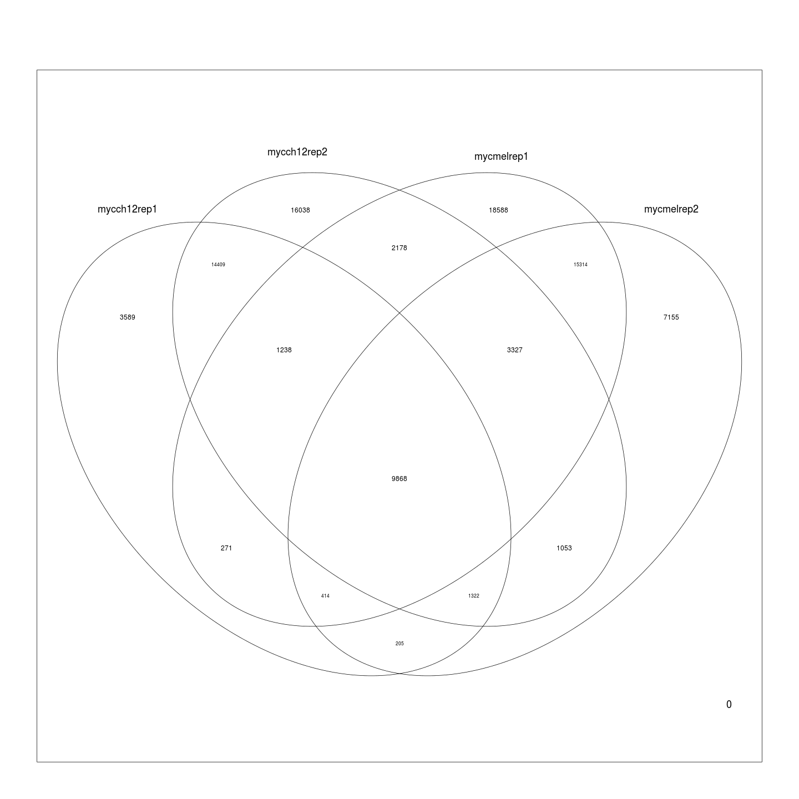

Differential Binding
========================================================
author: MRC Clinical Sciences Centre
date:http://mrccsc.github.io/r_course/introToR_Session1.html
width: 1440
height: 1100
autosize: true
font-import: <link href='http://fonts.googleapis.com/css?family=Slabo+27px' rel='stylesheet' type='text/css'>
font-family: 'Slabo 27px', serif;
css:style.css

Intor to differential binding
========================================================

We may expect binding to occur in differing conditions.
There are tow main ways of looking for differing peaks
Occupancy analysis 
Differential binding analysis

Here we will briefly discuss both

loading the libraries
========================================================


```r
library(ChIPQC)
library(soGGi)
library(DESeq2)
library(GenomicRanges)
library(Rsubread)
```


Reading in a peak from Macs
========================================================
Lets load a single set of peaks fromn Macs calls for Myc in mel and ch12 cell lines.

```r
macsPeaks <- dir("/Users/tcarroll/chipseqcourse/MacsPeaks/",full.names=T)
singlePeakSet <- ChIPQC:::GetGRanges(macsPeaks[1],sep="\t",simplify=T)
singlePeakSet
```

```
GRanges object with 33498 ranges and 7 metadata columns:
          seqnames             ranges strand   |        ID     Score
             <Rle>          <IRanges>  <Rle>   | <integer> <integer>
      [1]        1 [4480665, 4480849]      *   |       185   4480769
      [2]        1 [4661593, 4661934]      *   |       342   4661762
      [3]        1 [4774202, 4774393]      *   |       192   4774293
      [4]        1 [4775399, 4775792]      *   |       394   4775544
      [5]        1 [4775957, 4776125]      *   |       169   4776021
      ...      ...                ...    ... ...       ...       ...
  [33494]        Y [ 234019,  234250]      *   |       232    234139
  [33495]        Y [ 307766,  308084]      *   |       319    307929
  [33496]        Y [ 582005,  582258]      *   |       254    582128
  [33497]        Y [ 622964,  623320]      *   |       357    623149
  [33498]        Y [2721204, 2721372]      *   |       169   2721341
            Strand X.log10.pvalue. fold_enrichment X.log10.qvalue.
          <factor>       <numeric>       <numeric>       <numeric>
      [1]        *         6.89435         4.45956         4.21774
      [2]        *        30.49564        11.09288        26.75324
      [3]        *         5.83769         4.13574         3.27058
      [4]        *        17.08627         7.31683        13.80057
      [5]        *         5.66523         3.17407         3.10884
      ...      ...             ...             ...             ...
  [33494]        *        12.05558         5.10991         9.01059
  [33495]        *        43.34924        18.80093        39.29480
  [33496]        *         7.92002         5.08412         5.15692
  [33497]        *        15.31314         7.89867        12.10620
  [33498]        *         9.97111         6.14918         7.05846
                            name
                        <factor>
      [1]     mycch12rep1_peak_1
      [2]     mycch12rep1_peak_2
      [3]     mycch12rep1_peak_3
      [4]     mycch12rep1_peak_4
      [5]     mycch12rep1_peak_5
      ...                    ...
  [33494] mycch12rep1_peak_33494
  [33495] mycch12rep1_peak_33495
  [33496] mycch12rep1_peak_33496
  [33497] mycch12rep1_peak_33497
  [33498] mycch12rep1_peak_33498
  -------
  seqinfo: 22 sequences from an unspecified genome; no seqlengths
```

Getting a consensus set
========================================================
To get a consensus set first we "flatten" all peak sets to a single set of peaks occuring in any conditions.

Overlapping peaks are merged


```r
listOfPeaks <- GRangesList(lapply(macsPeaks,function(x)ChIPQC:::GetGRanges(x,sep="\t",simplify=T)))
flattenedPeaks <- unlist(listOfPeaks)
```

The next step would be to identify when samples shared peaks
========================================================

```r
matOfOverlaps <- sapply(listOfPeaks,function(x)
(flattenedPeaks %over% x)+0
)
colnames(matOfOverlaps) <- basename(gsub("_peaks\\.xls","",macsPeaks))
elementMetadata(flattenedPeaks) <- matOfOverlaps
flattenedPeaks[1:2,]
```

```
GRanges object with 2 ranges and 4 metadata columns:
      seqnames             ranges strand | mycch12rep1 mycch12rep2
         <Rle>          <IRanges>  <Rle> |   <numeric>   <numeric>
  [1]        1 [4480665, 4480849]      * |           1           0
  [2]        1 [4661593, 4661934]      * |           1           1
      mycmelrep1 mycmelrep2
       <numeric>  <numeric>
  [1]          0          0
  [2]          0          0
  -------
  seqinfo: 22 sequences from an unspecified genome; no seqlengths
```

========================================================
We can get a quick idea about where overlaps occur using vennCounts


```r
limma:::vennCounts(as.data.frame(elementMetadata(flattenedPeaks)))
```

```
   mycch12rep1 mycch12rep2 mycmelrep1 mycmelrep2 Counts
1            0           0          0          0      0
2            0           0          0          1   7159
3            0           0          1          0  18590
4            0           0          1          1  32537
5            0           1          0          0  16042
6            0           1          0          1   2364
7            0           1          1          0   5021
8            0           1          1          1  11163
9            1           0          0          0   3590
10           1           0          0          1    485
11           1           0          1          0    630
12           1           0          1          1   1483
13           1           1          0          0  29853
14           1           1          0          1   4239
15           1           1          1          0   4200
16           1           1          1          1  41876
attr(,"class")
[1] "VennCounts"
```


========================================================
Or we can view as VennDiagram

 


========================================================
Now we can identify common peaks


```r
mych12Peaks <- flattenedPeaks[elementMetadata(flattenedPeaks)$mycch12rep1 + 
                 elementMetadata(flattenedPeaks)$mycch12rep2 == 2]
mycMelPeaks <- flattenedPeaks[elementMetadata(flattenedPeaks)$mycmelrep1 +                  elementMetadata(flattenedPeaks)$mycmelrep2 == 2]
```

========================================================
And some unique peaks 

```r
mycMelPeaks_Only <- flattenedPeaks[elementMetadata(flattenedPeaks)$mycmelrep1 +                  elementMetadata(flattenedPeaks)$mycmelrep2 == 2 &
elementMetadata(flattenedPeaks)$mycch12rep1 + 
                 elementMetadata(flattenedPeaks)$mycch12rep2 == 0]

mycMelPeaks_Only
```

```
GRanges object with 32537 ranges and 4 metadata columns:
          seqnames                 ranges strand   | mycch12rep1
             <Rle>              <IRanges>  <Rle>   |   <numeric>
      [1]        1     [7606348, 7606524]      *   |           0
      [2]        1     [8124639, 8125376]      *   |           0
      [3]        1     [8132670, 8132956]      *   |           0
      [4]        1     [8163292, 8163604]      *   |           0
      [5]        1     [9272785, 9273376]      *   |           0
      ...      ...                    ...    ... ...         ...
  [32533]        X [165534705, 165535015]      *   |           0
  [32534]        X [165538081, 165538460]      *   |           0
  [32535]        X [165545334, 165545709]      *   |           0
  [32536]        X [165596324, 165596652]      *   |           0
  [32537]        X [165657748, 165658040]      *   |           0
          mycch12rep2 mycmelrep1 mycmelrep2
            <numeric>  <numeric>  <numeric>
      [1]           0          1          1
      [2]           0          1          1
      [3]           0          1          1
      [4]           0          1          1
      [5]           0          1          1
      ...         ...        ...        ...
  [32533]           0          1          1
  [32534]           0          1          1
  [32535]           0          1          1
  [32536]           0          1          1
  [32537]           0          1          1
  -------
  seqinfo: 22 sequences from an unspecified genome; no seqlengths
```

We can check the Venn to see our numbers add up

Simple Differential binding
========================================================
Now we take high confidence peaks in either condition.


```r
highConfidence_Only <- flattenedPeaks[elementMetadata(flattenedPeaks)$mycmelrep1 +                  elementMetadata(flattenedPeaks)$mycmelrep2 == 2 |
elementMetadata(flattenedPeaks)$mycch12rep1 + 
                 elementMetadata(flattenedPeaks)$mycch12rep2 == 2]
```

Simple Differential binding
========================================================
Now we can look to see if we need resizing.

```r
boxplot(width(highConfidence_Only))
abline(h=400,col="red")
```

 
The majority of peaks are around 400 so we will resize all peaks to this for ease here

Simple Differential binding
========================================================
Now we can resize to a sensible size

```r
PeaksToCount <- resize(highConfidence_Only,width = 400,fix = "center")
PeaksToCount
```

```
GRanges object with 125351 ranges and 4 metadata columns:
           seqnames                 ranges strand   | mycch12rep1
              <Rle>              <IRanges>  <Rle>   |   <numeric>
       [1]        1     [4661564, 4661963]      *   |           1
       [2]        1     [4775396, 4775795]      *   |           1
       [3]        1     [4775841, 4776240]      *   |           1
       [4]        1     [4847498, 4847897]      *   |           1
       [5]        1     [5015862, 5016261]      *   |           1
       ...      ...                    ...    ... ...         ...
  [125347]        X [165758130, 165758529]      *   |           1
  [125348]        Y [   233947,    234346]      *   |           1
  [125349]        Y [   581957,    582356]      *   |           1
  [125350]        Y [   622273,    622672]      *   |           0
  [125351]        Y [   622870,    623269]      *   |           1
           mycch12rep2 mycmelrep1 mycmelrep2
             <numeric>  <numeric>  <numeric>
       [1]           1          0          0
       [2]           1          1          1
       [3]           1          1          1
       [4]           1          1          1
       [5]           1          0          0
       ...         ...        ...        ...
  [125347]           1          1          1
  [125348]           1          0          1
  [125349]           1          1          1
  [125350]           1          1          1
  [125351]           1          1          1
  -------
  seqinfo: 22 sequences from an unspecified genome; no seqlengths
```

Simple Differential binding - Counting
========================================================
Now we can count the reads from each sample which land in our high confidence peaks

First we will count one file with featureCounts. The first step is to convert our files to SAF format.

```r
Bams <- dir("/Users/tcarroll/chipseqcourse/chipseqDataFQ/",pattern="*sorted\\..*bam$",full.names=T)
simplePeaksToCount <- ChIPQC:::GetGRanges(highConfidence_Only,simple=T,simplify=T)
toCount <- data.frame(GeneID = paste0("ID",seq(1,length(simplePeaksToCount))),
                      Chr=seqnames(simplePeaksToCount),Start=start(simplePeaksToCount),
                      End=end(simplePeaksToCount),Strand="-")
out  <- capture.output(myCountTable <- featureCounts(Bams[1],annot.ext = toCount,nthreads=4))
myCountTable$counts[1:10]
```

```
 [1] 0 0 3 0 0 0 4 0 1 1
```

Simple Differential binding - Counting all files
========================================================
Now we can use a lapply to count all samples in high confidence peaks


```r
out <- capture.output(
  myCountTableList <- lapply(Bams,function(x)
                               featureCounts(x,annot.ext = toCount,nthreads=4))
)
```

have a look at **out** to compare mapping ratres between input and 

Simple Differential binding - Stitching count files together
========================================================
Now we can use a lapply to count all samples in high confidence peaks


```r
countTable <- sapply(myCountTableList,function(x)x$counts)
rownames(countTable) <- paste0(toCount[,1],"-",toCount[,2],";",toCount[,3],"-",toCount[,4])
colnames(countTable) <- c("ch12myc","ch12myc","ch12input","melmyc","melmyc","meinput")
```


Simple Differential binding - A simple DEseq2 DE analysis
========================================================
Here we set up a DEseq2 object much as you would for RNAseq.
We define the conditions in **colData** as CellLines for Mel and ch12

This will identify any significant differennces in Myc binding between the cell lines.


```r
library("DESeq2")

colData <- data.frame(SampleName=colnames(countTable[,-c(3,6)]),CellLine=c("ch12","ch12","mel","mel"))
dds <- DESeqDataSetFromMatrix(countData = countTable[,-c(3,6)],
                              colData = colData,
                              design = ~ CellLine)

dds <- DESeq(dds)
testcellline <- results(dds, contrast=c("CellLine","ch12","mel"))
```

Simple Differential binding - Creating the DE GRanges
========================================================
Here we set up a DEseq2 object much as you would for RNAseq.
We define the conditions in **colData** as CellLines for Mel and ch12

This will identify any significant differennces in Myc binding between the cell lines.


```
GRanges object with 5 ranges and 6 metadata columns:
                               seqnames               ranges strand |
                                  <Rle>            <IRanges>  <Rle> |
   ID56199-7;89919508-89920626        7 [89919508, 89920626]      * |
   ID30011-1;85105988-85106691        1 [85105988, 85106691]      * |
  ID76925-19;59423707-59425963       19 [59423707, 59425963]      * |
     ID708-1;87501574-87501980        1 [87501574, 87501980]      * |
  ID11282-16;19200831-19201519       16 [19200831, 19201519]      * |
                                      .baseMean   .log2FoldChange
                                      <numeric>         <numeric>
   ID56199-7;89919508-89920626 140.344671573999  4.32881227533584
   ID30011-1;85105988-85106691 125.342227039855  3.70121016520507
  ID76925-19;59423707-59425963 79.3766681720876 -3.96774254614156
     ID708-1;87501574-87501980 74.4403339301691  3.68402408361114
  ID11282-16;19200831-19201519 48.4553188125988  5.67427660671764
                                          .lfcSE             .stat
                                       <numeric>         <numeric>
   ID56199-7;89919508-89920626 0.446648986778403  9.69175438314272
   ID30011-1;85105988-85106691 0.385564230862693  9.59946454816018
  ID76925-19;59423707-59425963  0.50510911835174 -7.85521860917697
     ID708-1;87501574-87501980 0.481723916151496  7.64758393779344
  ID11282-16;19200831-19201519 0.813707120387948    6.973364819534
                                            .pvalue                .padj
                                          <numeric>            <numeric>
   ID56199-7;89919508-89920626 3.26864986183481e-22 1.11114483403213e-17
   ID30011-1;85105988-85106691 8.03608017724777e-22  1.3658925477268e-17
  ID76925-19;59423707-59425963 3.99075478757085e-15 4.52205727495612e-11
     ID708-1;87501574-87501980 2.04790568309963e-14 1.74041264478222e-10
  ID11282-16;19200831-19201519 3.09448776794783e-12 2.10388034367237e-08
  -------
  seqinfo: 22 sequences from an unspecified genome; no seqlengths
```


