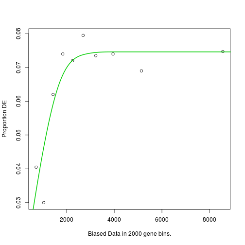
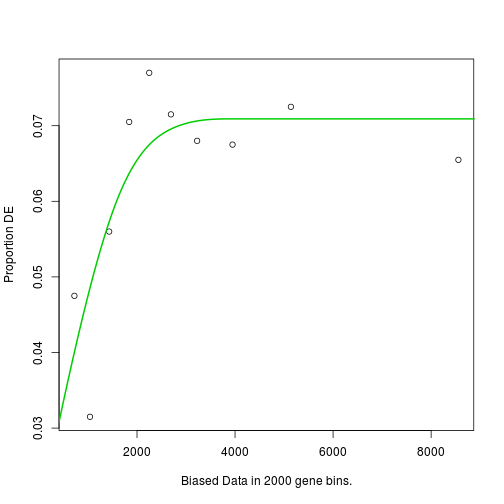
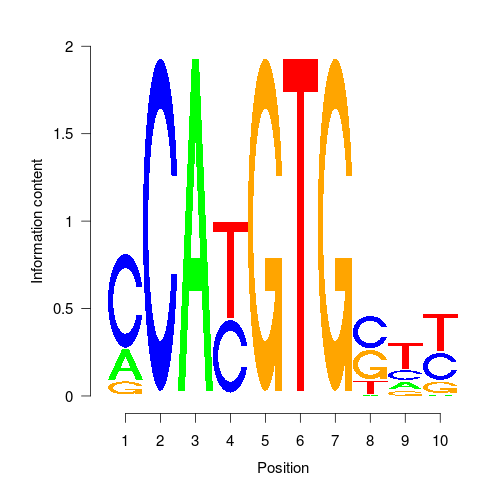

Functional Analysis
========================================================
author: MRC Clinical Sciences Centre
width: 1440
height: 1100
autosize: true
font-import: <link href='http://fonts.googleapis.com/css?family=Slabo+27px' rel='stylesheet' type='text/css'>
font-family: 'Slabo 27px', serif;
css:style.css

Brief bit of functional analysis
========================================================

Here we just wanted to show some simple things you can do with your peaks.
The choices are endless and will be expanded in future courses.

For now we will cover.

- Enrichment for GO/KEGG functions.
- Extraction of sequences under peaks for use in MEME-ChIP
- Scanning the genome with matchPWM

GO/KEGG enrichment
========================================================
First lets load our DE peaks from our Differential binding section.
We should have resummited but lets see for now,


```r
library(GenomicRanges)
library(DESeq2)
library(goseq)

load("../robjects/DEasGRanges.RData")
DEasGRanges[1,]
```

```
GRanges object with 1 range and 6 metadata columns:
                            seqnames               ranges strand |
                               <Rle>            <IRanges>  <Rle> |
  ID978-1;87500888-87501287        1 [87500888, 87501287]      * |
                                   .baseMean  .log2FoldChange
                                   <numeric>        <numeric>
  ID978-1;87500888-87501287 398.171664149091 5.49211025039039
                                       .lfcSE            .stat
                                    <numeric>        <numeric>
  ID978-1;87500888-87501287 0.307372671717581 17.8679198111556
                                         .pvalue                .padj
                                       <numeric>            <numeric>
  ID978-1;87500888-87501287 2.09668197518726e-71 9.62209292052939e-67
  -------
  seqinfo: 22 sequences from an unspecified genome; no seqlengths
```

Now we can select those padj < 0.05 and up/down in Mel
========================================================


```r
library(GenomicRanges)
library(GenomeInfoDb)
library(DESeq2)

UpInMel <- DEasGRanges[DEasGRanges$.padj < 0.05 
                       & !is.na(DEasGRanges$.padj) 
                       & DEasGRanges$.log2FoldChange > 0]

DownInMel <- DEasGRanges[DEasGRanges$.padj < 0.05 
                         & !is.na(DEasGRanges$.padj) 
                         & DEasGRanges$.log2FoldChange < 0]

length(UpInMel)
[1] 15826

length(DownInMel)
[1] 14564
```
So roughly equal in number of peaks higher or lower to Mel.
As these our GRanges object we can work with them directly.

Now we need to prepare some annotation. 
========================================================
Here we will read annotation from a flat file to get Gene ranges
In this case we have made a simple option to only keep protein coding genes and longest when selected aong transcripts.


```r
mm9Genes <- read.delim("../robjects/mm9Genes_May2012.txt",sep="\t",h=T)
mm9GeneRanges <- GRanges(seqnames=paste0("chr",mm9Genes[,3]),ranges=IRanges(start=mm9Genes[,1],end=mm9Genes[,2]),strand=mm9Genes[,4],name=mm9Genes[,5],biotype=mm9Genes[,6])

JustChrOfInterest <- unique(as.vector(seqnames(mm9GeneRanges)))[grep("\\d.|\\d|X|Y",unique(as.vector(seqnames(mm9GeneRanges))))]

mm9PC <- mm9GeneRanges[mm9GeneRanges$biotype == "protein_coding"]
mm9PC <- mm9PC[order(width(mm9PC),decreasing=T)]
mm9PC <- mm9PC[match(unique(mm9PC$name),mm9PC$name)]
mm9PC <- mm9PC[!mm9PC$name == ""]
mm9PC <- mm9PC[seqnames(mm9PC) %in% JustChrOfInterest]
mm9PC[1:3]
```

```
GRanges object with 3 ranges and 2 metadata columns:
      seqnames                 ranges strand |     name        biotype
         <Rle>              <IRanges>  <Rle> | <factor>       <factor>
  [1]     chr8 [122434741, 126869622]      + |  Gm20388 protein_coding
  [2]     chr7 [137305965, 140315033]      - |    Fgfr2 protein_coding
  [3]     chr4 [ 75587142,  77857865]      - |    Ptprd protein_coding
  -------
  seqinfo: 155 sequences from an unspecified genome; no seqlengths
```

Now we resize our genes around the TSS . 
========================================================

From an estimation of mean distance to TSS we could identify the optimal size. Here we will select 100bp+/- the TSS.


```r

mm9Promoters <- promoters(mm9PC,1000,1000)
mm9PC[1:2,]
GRanges object with 2 ranges and 2 metadata columns:
      seqnames                 ranges strand |     name        biotype
         <Rle>              <IRanges>  <Rle> | <factor>       <factor>
  [1]     chr8 [122434741, 126869622]      + |  Gm20388 protein_coding
  [2]     chr7 [137305965, 140315033]      - |    Fgfr2 protein_coding
  -------
  seqinfo: 155 sequences from an unspecified genome; no seqlengths
mm9Promoters[1:2,]
GRanges object with 2 ranges and 2 metadata columns:
      seqnames                 ranges strand |     name        biotype
         <Rle>              <IRanges>  <Rle> | <factor>       <factor>
  [1]     chr8 [122433741, 122435740]      + |  Gm20388 protein_coding
  [2]     chr7 [140314034, 140316033]      - |    Fgfr2 protein_coding
  -------
  seqinfo: 155 sequences from an unspecified genome; no seqlengths
mm9Promoters <- renameSeqlevels(mm9Promoters,gsub("chr","",seqlevels(mm9Promoters)))
mm9Promoters
GRanges object with 22244 ranges and 2 metadata columns:
          seqnames                 ranges strand   |     name
             <Rle>              <IRanges>  <Rle>   | <factor>
      [1]        8 [122433741, 122435740]      +   |  Gm20388
      [2]        7 [140314034, 140316033]      -   |    Fgfr2
      [3]        4 [ 77856866,  77858865]      -   |    Ptprd
      [4]        X [ 80193209,  80195208]      +   |      Dmd
      [5]        6 [ 45009060,  45011059]      +   |  Cntnap2
      ...      ...                    ...    ... ...      ...
  [22240]       10 [ 33713861,  33715860]      -   |  Gm17567
  [22241]        6 [ 53768969,  53770968]      +   |  Gm16499
  [22242]       12 [ 36218643,  36220642]      +   |  Gm17436
  [22243]        2 [155560603, 155562602]      -   |  Gm17581
  [22244]        2 [ 11545968,  11547967]      -   |  Gm17355
                 biotype
                <factor>
      [1] protein_coding
      [2] protein_coding
      [3] protein_coding
      [4] protein_coding
      [5] protein_coding
      ...            ...
  [22240] protein_coding
  [22241] protein_coding
  [22242] protein_coding
  [22243] protein_coding
  [22244] protein_coding
  -------
  seqinfo: 155 sequences from an unspecified genome; no seqlengths
```

And overlap our 2 sets of DE genes with promoters
========================================================


```r
GeneswithUpInMel <- mm9Promoters %over% UpInMel + 0
GeneswithDownInMel <- mm9Promoters %over% DownInMel + 0

names(GeneswithUpInMel) <- names(GeneswithDownInMel) <- mm9Promoters$name
```


Now we have genes associated to our DE peaks we can do some gene set testing
========================================================

First a little helper function


```r
library(KEGG.db)
library(goseq)
xx <- as.list(KEGGPATHID2NAME)
temp <- cbind(names(xx),unlist(xx))
addKeggTogoseq <- function(JX,temp){
  for(l in 1:nrow(JX)){
    if(JX[l,1] %in% temp[,1]){
      JX[l,"term"] <- temp[temp[,1] %in% JX[l,1],2]
      JX[l,"ontology"] <- "KEGG"
    }
    
  }
  return(JX)
}
```

Now we we will use GOseq for the analysis
========================================================

And now the testing using goseq


```r
pwf=nullp(GeneswithUpInMel,"mm9","geneSymbol")
```

 

```r
GeneswithUpInMelEnrich <- goseq(pwf,"mm9","geneSymbol",test.cats=c("GO:BP","GO:MF","KEGG"),method="Hypergeometric")
pwf=nullp(GeneswithDownInMel,"mm9","geneSymbol")
```

 

```r
GeneswithDownInMelEnrich <- goseq(pwf,"mm9","geneSymbol",test.cats=c("GO:BP","GO:MF","KEGG"),method="Hypergeometric")

GeneswithUpInMelEnrich <- addKeggTogoseq(GeneswithUpInMelEnrich,temp)
GeneswithDownInMelEnrich <- addKeggTogoseq(GeneswithDownInMelEnrich,temp)
```


Results Up in Mel
========================================================

Genes where Myc is up in MEL


```r
GeneswithUpInMelEnrich[1:10,]
```

```
        category over_represented_pvalue under_represented_pvalue
1104  GO:0002376            3.332340e-23                        1
11773 GO:0046649            4.357870e-23                        1
11154 GO:0045321            1.631370e-22                        1
3351  GO:0006955            3.564995e-21                        1
724   GO:0001775            3.134688e-18                        1
9885  GO:0042110            1.084379e-16                        1
14854 GO:0070489            1.084379e-16                        1
15344 GO:0071593            1.433578e-16                        1
14851 GO:0070486            4.284437e-16                        1
3460  GO:0007159            1.159028e-15                        1
      numDEInCat numInCat                         term ontology
1104         230     1911        immune system process       BP
11773        102      556        lymphocyte activation       BP
11154        112      658         leukocyte activation       BP
3351         136      923              immune response       BP
724          114      765              cell activation       BP
9885          73      400            T cell activation       BP
14854         73      400           T cell aggregation       BP
15344         73      402       lymphocyte aggregation       BP
14851         73      410        leukocyte aggregation       BP
3460          75      436 leukocyte cell-cell adhesion       BP
```

Results Down in Mel
========================================================

Genes where Myc is down in MEL


```r
GeneswithDownInMelEnrich[1:10,]
```

```
        category over_represented_pvalue under_represented_pvalue
10827 GO:0044237            5.400988e-16                        1
5430  GO:0016043            1.647833e-14                        1
3756  GO:0008152            3.835440e-14                        1
15410 GO:0071704            7.661205e-14                        1
15461 GO:0071840            7.936145e-14                        1
11687 GO:0046483            1.027342e-12                        1
16945 GO:1901360            1.501583e-12                        1
10828 GO:0044238            2.125948e-12                        1
3211  GO:0006725            5.382574e-12                        1
10844 GO:0044260            6.755791e-12                        1
      numDEInCat numInCat                                          term
10827        629     8293                    cellular metabolic process
5430         400     4807               cellular component organization
3756         684     9354                             metabolic process
15410        643     8697           organic substance metabolic process
15461        406     4945 cellular component organization or biogenesis
11687        376     4573                 heterocycle metabolic process
16945        390     4796     organic cyclic compound metabolic process
10828        615     8361                     primary metabolic process
3211         375     4611  cellular aromatic compound metabolic process
10844        509     6694      cellular macromolecule metabolic process
      ontology
10827       BP
5430        BP
3756        BP
15410       BP
15461       BP
11687       BP
16945       BP
10828       BP
3211        BP
10844       BP
```


Now lets look for Motifs.
============================

There are a few choices for Motif Enrichment in R but many focus on expression data and their associated promoters.

Making an appropriate background can be hard.

One tactic is to identify Motifs using Meme-ChIP online.

First we have to extract sequences under the DB peaks

Extracting sequences under regions
============================

```r
library(BSgenome)
library(BSgenome.Mmusculus.UCSC.mm9)
genome <- BSgenome.Mmusculus.UCSC.mm9
UpInMel <- renameSeqlevels(UpInMel,paste0("chr",seqlevels(UpInMel)))
UpInMel <- UpInMel[seqnames(UpInMel) != "chrMT"]

DownInMel <- renameSeqlevels(DownInMel,paste0("chr",seqlevels(DownInMel)))
DownInMel <- DownInMel[seqnames(DownInMel) != "chrMT"]

UpinMelSequences <- getSeq(genome,GRanges(UpInMel))
DowninMelSequences <- getSeq(genome,GRanges(DownInMel))

DowninMelSequences[1:2,]
```

```
  A DNAStringSet instance of length 2
    width seq                                          names               
[1]   400 TGCAGCCGTGACTGCGAGCGA...TTCCAGGAAACAGAGACTTC ID5406-11;3093141...
[2]   400 GGGCTTGTTCTAGAGTCTACT...AGTGATCAGTGGTTCACTTC ID30091-4;4596621...
```

Writing to FASTA file
============================

```r
writeXStringSet(DowninMelSequences,file="DowninMel.fa")
writeXStringSet(UpinMelSequences,file="UpinMel.fa")
```

Installing Jaspar
============================

```r
source("https://bioconductor.org/biocLite.R")
biocLite("MotifDB")
```

Installing Jaspar
============================

```r
library(seqLogo)
library(MotifDb)
PotentialMyc <- as.list(subset (MotifDb, tolower (geneSymbol) == "myc"))
seqLogo(PotentialMyc[[9]])
```

 

Frequency of motifs per basepair peaks
============================

```r
UpinMelCount <- lapply(UpinMelSequences,function(x)countPWM(PotentialMyc[[9]],x))
DowninMelCount <- lapply(DowninMelSequences,function(x)countPWM(PotentialMyc[[9]],x))
RevComUpinMelCount <- lapply(reverseComplement(UpinMelSequences),function(x)countPWM(PotentialMyc[[9]],x))
RevComDowninMelCount <- lapply(reverseComplement(DowninMelSequences),function(x)countPWM(PotentialMyc[[9]],x))


UpinMelFreq <- (sum(unlist(c(UpinMelCount,RevComUpinMelCount))))/(sum(width(UpinMelSequences))*2)
DowninMelFreq <- (sum(unlist(c(DowninMelCount,RevComDowninMelCount))))/(sum(width(DowninMelSequences))*2)
```

Frequency of motifs per basepair Chr1
============================


```r
chr1MycCounts <- countPWM(PotentialMyc[[9]],genome$chr1)
RevComchr1MycCounts <- countPWM(PotentialMyc[[9]],reverseComplement(genome$chr1))
chr1Freq <- (sum(c(chr1MycCounts,RevComchr1MycCounts)))/(length(genome$chr1)*2)
```

Frequency comparison
============================


```r

UpinMelFreq
[1] 0.00221685
DowninMelFreq
[1] 0.001850882
chr1Freq
[1] 0.001198704
```

Session Info
==========================


```r
sessionInfo()
```

```
R version 3.2.2 (2015-08-14)
Platform: x86_64-pc-linux-gnu (64-bit)
Running under: Ubuntu 14.04.2 LTS

locale:
 [1] LC_CTYPE=en_US.UTF-8       LC_NUMERIC=C              
 [3] LC_TIME=en_US.UTF-8        LC_COLLATE=en_US.UTF-8    
 [5] LC_MONETARY=en_US.UTF-8    LC_MESSAGES=en_US.UTF-8   
 [7] LC_PAPER=en_US.UTF-8       LC_NAME=C                 
 [9] LC_ADDRESS=C               LC_TELEPHONE=C            
[11] LC_MEASUREMENT=en_US.UTF-8 LC_IDENTIFICATION=C       

attached base packages:
 [1] grid      stats4    parallel  stats     graphics  grDevices utils    
 [8] datasets  methods   base     

other attached packages:
 [1] MotifDb_1.12.0                    seqLogo_1.36.0                   
 [3] BSgenome.Mmusculus.UCSC.mm9_1.4.0 BSgenome_1.38.0                  
 [5] rtracklayer_1.30.0                Biostrings_2.38.0                
 [7] XVector_0.10.0                    org.Mm.eg.db_3.2.3               
 [9] KEGG.db_3.2.2                     AnnotationDbi_1.32.0             
[11] goseq_1.22.0                      RSQLite_1.0.0                    
[13] DBI_0.3.1                         geneLenDataBase_1.5.0            
[15] BiasedUrn_1.06.1                  DESeq2_1.10.0                    
[17] RcppArmadillo_0.6.100.0.0         Rcpp_0.12.1                      
[19] SummarizedExperiment_1.0.0        Biobase_2.30.0                   
[21] GenomicRanges_1.22.0              GenomeInfoDb_1.6.0               
[23] IRanges_2.4.0                     S4Vectors_0.8.0                  
[25] BiocGenerics_0.16.0               knitr_1.11                       
[27] BiocInstaller_1.20.0             

loaded via a namespace (and not attached):
 [1] locfit_1.5-9.1          lattice_0.20-33        
 [3] GO.db_3.2.2             Rsamtools_1.22.0       
 [5] digest_0.6.8            plyr_1.8.3             
 [7] futile.options_1.0.0    acepack_1.3-3.3        
 [9] evaluate_0.8            ggplot2_1.0.1          
[11] zlibbioc_1.16.0         GenomicFeatures_1.22.0 
[13] annotate_1.48.0         Matrix_1.2-2           
[15] rpart_4.1-10            proto_0.3-10           
[17] splines_3.2.2           BiocParallel_1.3.54    
[19] geneplotter_1.48.0      stringr_1.0.0          
[21] foreign_0.8-66          RCurl_1.95-4.7         
[23] biomaRt_2.26.0          munsell_0.4.2          
[25] mgcv_1.8-7              nnet_7.3-11            
[27] gridExtra_2.0.0         Hmisc_3.17-0           
[29] XML_3.98-1.3            GenomicAlignments_1.6.0
[31] MASS_7.3-44             bitops_1.0-6           
[33] nlme_3.1-122            xtable_1.7-4           
[35] gtable_0.1.2            magrittr_1.5           
[37] formatR_1.2.1           scales_0.3.0           
[39] stringi_0.5-5           reshape2_1.4.1         
[41] genefilter_1.52.0       latticeExtra_0.6-26    
[43] futile.logger_1.4.1     Formula_1.2-1          
[45] lambda.r_1.1.7          RColorBrewer_1.1-2     
[47] tools_3.2.2             survival_2.38-3        
[49] colorspace_1.2-6        cluster_2.0.3          
```


