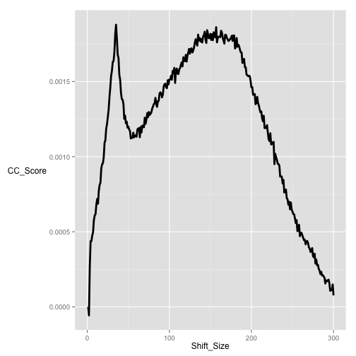
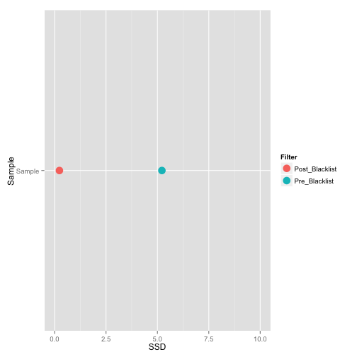
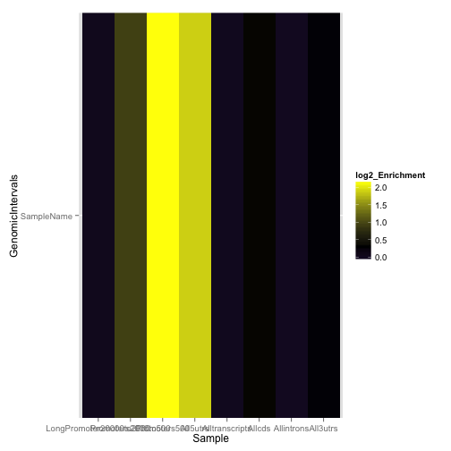
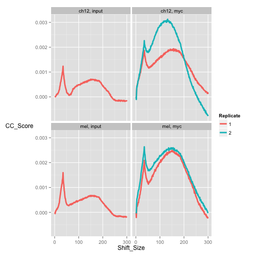

Initial ChIP-QC
========================================================
author: MRC Clinical Sciences Centre
date:http://mrccsc.github.io/r_course/introToR_Session1.html
width: 1440
height: 1100
autosize: true
font-import: <link href='http://fonts.googleapis.com/css?family=Slabo+27px' rel='stylesheet' type='text/css'>
font-family: 'Slabo 27px', serif;
css:style.css

ChIP-QC
========================================================

ChIP-seq data is very noisy and can be variable in specificity and sensitivity depending on the ChIP antibody used.

Several tools exist in R to allow us to evaluate our ChIPQC prior to peak calling and post visualisation in a browser.

ChIPQC package
========================================================

The ChIPQC package was developed to wrap up most of the useful metrics and place them in the right context.

Given unfiltered data it processes the data and gathers the QC metrics at the appropriate filtering steps.

Loading packages
===============
First lets load the packages we need


```r
library(DiffBind)
library(ChIPQC)
library(GenomeInfoDb)
library(BiocParallel)
```


ChIPQCsample
========================================================

The most basic function in ChIPQC is ChIPQCsample() which will gather the information on a single sample.

Just a BAM file name, genome for annotation and any areas of blacklisted signal.


ChIPQC accecpts a BAM file (with or without index). 
It is also recommended to provide a genome to test for enrichment in genomic features and a Blacklist.


```r
indexedBams[1]
```

```
[1] "/Users/tcarroll/chipseqcourse/chipseqDataFQ//wgEncodeSydhTfbsCh12CmycIggrabRawDataRep1sorted.bam.bam"
```

```r
myQC <- ChIPQCsample(indexedBams[1],
             annotation="mm9",
             blacklist="/Users/tcarroll/chipseqcourse//referenceData/mm9-blacklist.bed",chromosomes=paste0(1:2))
```

```

 1 / 300
 2 / 300
 3 / 300
 4 / 300
 5 / 300
 6 / 300
 7 / 300
 8 / 300
 9 / 300
 10 / 300
 11 / 300
 12 / 300
 13 / 300
 14 / 300
 15 / 300
 16 / 300
 17 / 300
 18 / 300
 19 / 300
 20 / 300
 21 / 300
 22 / 300
 23 / 300
 24 / 300
 25 / 300
 26 / 300
 27 / 300
 28 / 300
 29 / 300
 30 / 300
 31 / 300
 32 / 300
 33 / 300
 34 / 300
 35 / 300
 36 / 300
 37 / 300
 38 / 300
 39 / 300
 40 / 300
 41 / 300
 42 / 300
 43 / 300
 44 / 300
 45 / 300
 46 / 300
 47 / 300
 48 / 300
 49 / 300
 50 / 300
 51 / 300
 52 / 300
 53 / 300
 54 / 300
 55 / 300
 56 / 300
 57 / 300
 58 / 300
 59 / 300
 60 / 300
 61 / 300
 62 / 300
 63 / 300
 64 / 300
 65 / 300
 66 / 300
 67 / 300
 68 / 300
 69 / 300
 70 / 300
 71 / 300
 72 / 300
 73 / 300
 74 / 300
 75 / 300
 76 / 300
 77 / 300
 78 / 300
 79 / 300
 80 / 300
 81 / 300
 82 / 300
 83 / 300
 84 / 300
 85 / 300
 86 / 300
 87 / 300
 88 / 300
 89 / 300
 90 / 300
 91 / 300
 92 / 300
 93 / 300
 94 / 300
 95 / 300
 96 / 300
 97 / 300
 98 / 300
 99 / 300
 100 / 300
 101 / 300
 102 / 300
 103 / 300
 104 / 300
 105 / 300
 106 / 300
 107 / 300
 108 / 300
 109 / 300
 110 / 300
 111 / 300
 112 / 300
 113 / 300
 114 / 300
 115 / 300
 116 / 300
 117 / 300
 118 / 300
 119 / 300
 120 / 300
 121 / 300
 122 / 300
 123 / 300
 124 / 300
 125 / 300
 126 / 300
 127 / 300
 128 / 300
 129 / 300
 130 / 300
 131 / 300
 132 / 300
 133 / 300
 134 / 300
 135 / 300
 136 / 300
 137 / 300
 138 / 300
 139 / 300
 140 / 300
 141 / 300
 142 / 300
 143 / 300
 144 / 300
 145 / 300
 146 / 300
 147 / 300
 148 / 300
 149 / 300
 150 / 300
 151 / 300
 152 / 300
 153 / 300
 154 / 300
 155 / 300
 156 / 300
 157 / 300
 158 / 300
 159 / 300
 160 / 300
 161 / 300
 162 / 300
 163 / 300
 164 / 300
 165 / 300
 166 / 300
 167 / 300
 168 / 300
 169 / 300
 170 / 300
 171 / 300
 172 / 300
 173 / 300
 174 / 300
 175 / 300
 176 / 300
 177 / 300
 178 / 300
 179 / 300
 180 / 300
 181 / 300
 182 / 300
 183 / 300
 184 / 300
 185 / 300
 186 / 300
 187 / 300
 188 / 300
 189 / 300
 190 / 300
 191 / 300
 192 / 300
 193 / 300
 194 / 300
 195 / 300
 196 / 300
 197 / 300
 198 / 300
 199 / 300
 200 / 300
 201 / 300
 202 / 300
 203 / 300
 204 / 300
 205 / 300
 206 / 300
 207 / 300
 208 / 300
 209 / 300
 210 / 300
 211 / 300
 212 / 300
 213 / 300
 214 / 300
 215 / 300
 216 / 300
 217 / 300
 218 / 300
 219 / 300
 220 / 300
 221 / 300
 222 / 300
 223 / 300
 224 / 300
 225 / 300
 226 / 300
 227 / 300
 228 / 300
 229 / 300
 230 / 300
 231 / 300
 232 / 300
 233 / 300
 234 / 300
 235 / 300
 236 / 300
 237 / 300
 238 / 300
 239 / 300
 240 / 300
 241 / 300
 242 / 300
 243 / 300
 244 / 300
 245 / 300
 246 / 300
 247 / 300
 248 / 300
 249 / 300
 250 / 300
 251 / 300
 252 / 300
 253 / 300
 254 / 300
 255 / 300
 256 / 300
 257 / 300
 258 / 300
 259 / 300
 260 / 300
 261 / 300
 262 / 300
 263 / 300
 264 / 300
 265 / 300
 266 / 300
 267 / 300
 268 / 300
 269 / 300
 270 / 300
 271 / 300
 272 / 300
 273 / 300
 274 / 300
 275 / 300
 276 / 300
 277 / 300
 278 / 300
 279 / 300
 280 / 300
 281 / 300
 282 / 300
 283 / 300
 284 / 300
 285 / 300
 286 / 300
 287 / 300
 288 / 300
 289 / 300
 290 / 300
 291 / 300
 292 / 300
 293 / 300
 294 / 300
 295 / 300
 296 / 300
 297 / 300
 298 / 300
 299 / 300
 300 / 300

 1 / 300
 2 / 300
 3 / 300
 4 / 300
 5 / 300
 6 / 300
 7 / 300
 8 / 300
 9 / 300
 10 / 300
 11 / 300
 12 / 300
 13 / 300
 14 / 300
 15 / 300
 16 / 300
 17 / 300
 18 / 300
 19 / 300
 20 / 300
 21 / 300
 22 / 300
 23 / 300
 24 / 300
 25 / 300
 26 / 300
 27 / 300
 28 / 300
 29 / 300
 30 / 300
 31 / 300
 32 / 300
 33 / 300
 34 / 300
 35 / 300
 36 / 300
 37 / 300
 38 / 300
 39 / 300
 40 / 300
 41 / 300
 42 / 300
 43 / 300
 44 / 300
 45 / 300
 46 / 300
 47 / 300
 48 / 300
 49 / 300
 50 / 300
 51 / 300
 52 / 300
 53 / 300
 54 / 300
 55 / 300
 56 / 300
 57 / 300
 58 / 300
 59 / 300
 60 / 300
 61 / 300
 62 / 300
 63 / 300
 64 / 300
 65 / 300
 66 / 300
 67 / 300
 68 / 300
 69 / 300
 70 / 300
 71 / 300
 72 / 300
 73 / 300
 74 / 300
 75 / 300
 76 / 300
 77 / 300
 78 / 300
 79 / 300
 80 / 300
 81 / 300
 82 / 300
 83 / 300
 84 / 300
 85 / 300
 86 / 300
 87 / 300
 88 / 300
 89 / 300
 90 / 300
 91 / 300
 92 / 300
 93 / 300
 94 / 300
 95 / 300
 96 / 300
 97 / 300
 98 / 300
 99 / 300
 100 / 300
 101 / 300
 102 / 300
 103 / 300
 104 / 300
 105 / 300
 106 / 300
 107 / 300
 108 / 300
 109 / 300
 110 / 300
 111 / 300
 112 / 300
 113 / 300
 114 / 300
 115 / 300
 116 / 300
 117 / 300
 118 / 300
 119 / 300
 120 / 300
 121 / 300
 122 / 300
 123 / 300
 124 / 300
 125 / 300
 126 / 300
 127 / 300
 128 / 300
 129 / 300
 130 / 300
 131 / 300
 132 / 300
 133 / 300
 134 / 300
 135 / 300
 136 / 300
 137 / 300
 138 / 300
 139 / 300
 140 / 300
 141 / 300
 142 / 300
 143 / 300
 144 / 300
 145 / 300
 146 / 300
 147 / 300
 148 / 300
 149 / 300
 150 / 300
 151 / 300
 152 / 300
 153 / 300
 154 / 300
 155 / 300
 156 / 300
 157 / 300
 158 / 300
 159 / 300
 160 / 300
 161 / 300
 162 / 300
 163 / 300
 164 / 300
 165 / 300
 166 / 300
 167 / 300
 168 / 300
 169 / 300
 170 / 300
 171 / 300
 172 / 300
 173 / 300
 174 / 300
 175 / 300
 176 / 300
 177 / 300
 178 / 300
 179 / 300
 180 / 300
 181 / 300
 182 / 300
 183 / 300
 184 / 300
 185 / 300
 186 / 300
 187 / 300
 188 / 300
 189 / 300
 190 / 300
 191 / 300
 192 / 300
 193 / 300
 194 / 300
 195 / 300
 196 / 300
 197 / 300
 198 / 300
 199 / 300
 200 / 300
 201 / 300
 202 / 300
 203 / 300
 204 / 300
 205 / 300
 206 / 300
 207 / 300
 208 / 300
 209 / 300
 210 / 300
 211 / 300
 212 / 300
 213 / 300
 214 / 300
 215 / 300
 216 / 300
 217 / 300
 218 / 300
 219 / 300
 220 / 300
 221 / 300
 222 / 300
 223 / 300
 224 / 300
 225 / 300
 226 / 300
 227 / 300
 228 / 300
 229 / 300
 230 / 300
 231 / 300
 232 / 300
 233 / 300
 234 / 300
 235 / 300
 236 / 300
 237 / 300
 238 / 300
 239 / 300
 240 / 300
 241 / 300
 242 / 300
 243 / 300
 244 / 300
 245 / 300
 246 / 300
 247 / 300
 248 / 300
 249 / 300
 250 / 300
 251 / 300
 252 / 300
 253 / 300
 254 / 300
 255 / 300
 256 / 300
 257 / 300
 258 / 300
 259 / 300
 260 / 300
 261 / 300
 262 / 300
 263 / 300
 264 / 300
 265 / 300
 266 / 300
 267 / 300
 268 / 300
 269 / 300
 270 / 300
 271 / 300
 272 / 300
 273 / 300
 274 / 300
 275 / 300
 276 / 300
 277 / 300
 278 / 300
 279 / 300
 280 / 300
 281 / 300
 282 / 300
 283 / 300
 284 / 300
 285 / 300
 286 / 300
 287 / 300
 288 / 300
 289 / 300
 290 / 300
 291 / 300
 292 / 300
 293 / 300
 294 / 300
 295 / 300
 296 / 300
 297 / 300
 298 / 300
 299 / 300
 300 / 300
[1] 1
[1] 1
```


Strange Results for Reads in Blacklist and features.
========================================================

```r
myQC
```

```
                        ProportionOfCounts
BlackList                                0
LongPromoter20000to2000                  0
Promoters2000to500                       0
Promoters500                             0
All5utrs                                 0
Alltranscripts                           0
Allcds                                   0
Allintrons                               0
All3utrs                                 0
GRanges object with 0 ranges and 0 metadata columns:
   seqnames    ranges strand
      <Rle> <IRanges>  <Rle>
  -------
  seqinfo: no sequences
```

Fixing differences in Genome Contig Annotation.
========================================================
Lets check names of contigs in our BAMS


```r
myBam <- BamFile(indexedBams[1])
names(scanBamHeader(myBam)$targets)
```

```
 [1] "10" "11" "12" "13" "14" "15" "16" "17" "18" "19" "1"  "2"  "3"  "4" 
[15] "5"  "6"  "7"  "8"  "9"  "MT" "X"  "Y" 
```

Fixing differences in Genome Contig Annotation
========================================================
The names in our files start with a chr so we will have to fix these using the **renameSeqlevels** function


```r
myBL <- ChIPQC:::GetGRanges("/Users/tcarroll/chipseqcourse//referenceData/mm9-blacklist.bed")
myBL <- renameSeqlevels(myBL,gsub("chr","",seqlevels(myBL)))
```

We will also need to the same for gene annotation
========================================================
We can extract,alter and provide custom feature annotation for ChIPQC


```r
mm9Anno <- ChIPQC:::getAnnotation("mm9",AllChr=NULL)
mm9AnnoNew <- lapply(mm9Anno[-1],
                  function(x)
                  renameSeqlevels(x,gsub("chr","",seqlevels(x))
                       )
              )
```

Lets now provide fixed annotation
========================================================
We can now try with fixed annotation


```r
myQC <- ChIPQCsample(indexedBams[1],
             annotation=mm9AnnoNew,
             blacklist = myBL,
             chromosomes=paste0(1:10)
             )
```

These results look better
========================================================

```r
load("../robjects/singleSampleQC.RData")
```


```r
myQC
```

```
                        ProportionOfCounts
BlackList                      0.138962494
LongPromoter20000to2000        0.164999877
Promoters2000to500             0.027274214
Promoters500                   0.021972120
All5utrs                       0.009702207
Alltranscripts                 0.421248126
Allcds                         0.017216495
Allintrons                     0.393648791
All3utrs                       0.013905895
GRanges object with 0 ranges and 0 metadata columns:
   seqnames    ranges strand
      <Rle> <IRanges>  <Rle>
  -------
  seqinfo: no sequences
```

Some useful plots
=========================================================
In the CC plot we see fragment length and artefact peak. Note in this samnple the artefact peak is higher then fragment length peak


```r
p <- plotCC(myQC)
p$layers[[2]] <- NULL
p
```

 

Some more useful plots
=========================================================
By comparing SSD before and after Blacklisting we get an understanding of artefact and remaining signal.


```r
plotSSD(myQC)+xlim(0,10)
```

 

Some more useful plots
=========================================================
By using Regi plot we can see where the distribution of signal in our features.


```r
plotRegi(myQC)
```

 

Running across an experiment
=========================================================
Lets set up a ChIPQC evaluation across all the experiments


Plotting across an entire experiment
=========================================================
You should have an object loaded called ss. This Samplesheet is required to merge individual ChIPQCsample results.


```r
ss
```

```
    SampleID Tissue Factor Treatment Replicate Condition
1 myc_ch12_1   ch12    myc        NA         1        NA
2 myc_ch12_2   ch12    myc        NA         2        NA
3 input_ch12   ch12  input        NA         1        NA
4  myc_Mel_1    mel    myc        NA         1        NA
5  myc_Mel_2    mel    myc        NA         2        NA
6  input_Mel    mel  input        NA         1        NA
                                                                                              bamReads
1 /Users/tcarroll/chipseqcourse/chipseqDataFQ//wgEncodeSydhTfbsCh12CmycIggrabRawDataRep1sorted.bam.bam
2 /Users/tcarroll/chipseqcourse/chipseqDataFQ//wgEncodeSydhTfbsCh12CmycIggrabRawDataRep2sorted.bam.bam
3    /Users/tcarroll/chipseqcourse/chipseqDataFQ//wgEncodeSydhTfbsCh12InputIggmusRawDatasorted.bam.bam
4  /Users/tcarroll/chipseqcourse/chipseqDataFQ//wgEncodeSydhTfbsMelCmycIggrabRawDataRep1sorted.bam.bam
5  /Users/tcarroll/chipseqcourse/chipseqDataFQ//wgEncodeSydhTfbsMelCmycIggrabRawDataRep2sorted.bam.bam
6     /Users/tcarroll/chipseqcourse/chipseqDataFQ//wgEncodeSydhTfbsMelInputIggmusRawDatasorted.bam.bam
  bamControl ControlID Peaks
1       <NA>        NA  <NA>
2       <NA>        NA  <NA>
3       <NA>        NA  <NA>
4       <NA>        NA  <NA>
5       <NA>        NA  <NA>
6       <NA>        NA  <NA>
```

Plotting across an entire experiment
=========================================================
You should have an object loaded called ss


```r
myRes2 <- ChIPQC(ss,samples=myRes)
```


```r
p <- plotCC(myRes2)
p$layers[[2]] <- NULL
p
```

 
     
We will come back to QC when we have some peaks.
