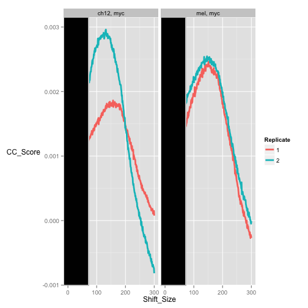
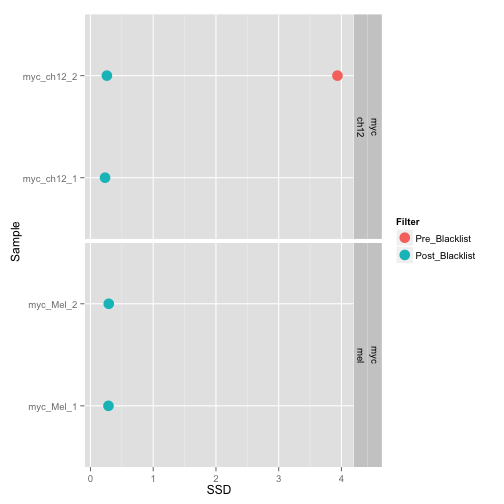
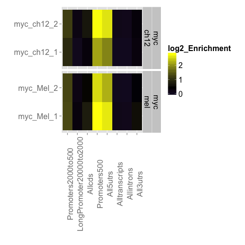
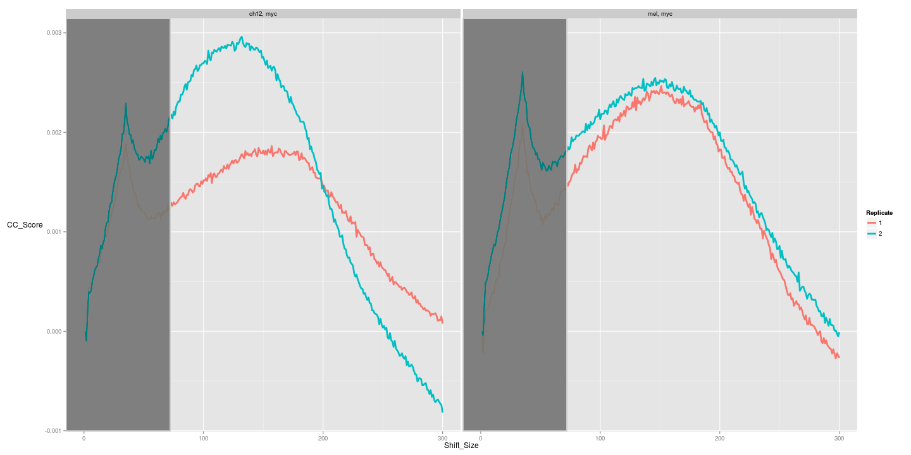
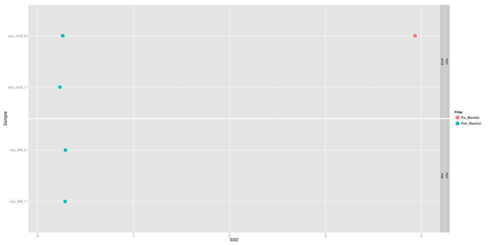
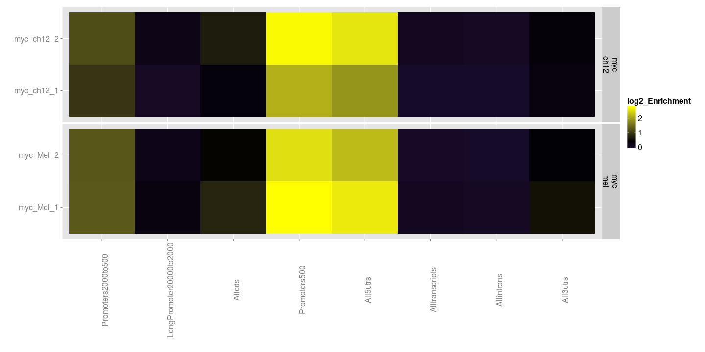

postPeakCallingQC
========================================================
author: MRC Clinical Sciences Centre
date:http://mrccsc.github.io/r_course/introToR_Session1.html
width: 1440
height: 1100
autosize: true
font-import: <link href='http://fonts.googleapis.com/css?family=Slabo+27px' rel='stylesheet' type='text/css'>
font-family: 'Slabo 27px', serif;
css:style.css
First Steps in Alignment


QC post peak calling
========================================================

```r
library(ChIPQC)
library(GenomeInfoDb)
```
Fixing differences in Genome Contig Annotation.2
========================================================
Lets check names of contigs in our BAMS

```r
myBL <- ChIPQC:::GetGRanges("/Users/tcarroll/chipseqcourse//referenceData/mm9-blacklist.bed")
myBL <- renameSeqlevels(myBL,gsub("chr","",seqlevels(myBL)))
```

We will also need to the same for gene annotation
========================================================
We can extract,alter and provide custom feature annotation for ChIPQC


```r
mm9Anno <- ChIPQC:::getAnnotation("mm9",AllChr=NULL)
mm9AnnoNew <- lapply(mm9Anno[-1],
                  function(x)
                  renameSeqlevels(x,gsub("chr","",seqlevels(x))
                       )
              )
```

Setting up ChIPQC the Diffbind way
========================================================


```r
indexedBams <- dir("/Users/tcarroll/chipseqcourse/chipseqDataFQ/",pattern="*sorted\\..*bam$",full.names=T)
SampleID <- c("myc_ch12_1","myc_ch12_2","myc_Mel_1","myc_Mel_2")
Tissue <- c(rep("ch12",2),rep("mel",2))
Treatment <- rep(NA,4)
Condition <- rep(NA,4)
Factor <- c(rep("myc",2),rep("myc",2))
Replicate <- c(1,2,1,2)
bamReads  <- indexedBams[-c(3,6)]
bamControl= c("/Users/tcarroll/chipseqcourse/chipseqDataFQ//wgEncodeSydhTfbsCh12InputIggmusRawDatasorted.bam.bam",
              "/Users/tcarroll/chipseqcourse/chipseqDataFQ//wgEncodeSydhTfbsCh12InputIggmusRawDatasorted.bam.bam",
              "/Users/tcarroll/chipseqcourse/chipseqDataFQ//wgEncodeSydhTfbsMelInputIggmusRawDatasorted.bam.bam",
              "/Users/tcarroll/chipseqcourse/chipseqDataFQ//wgEncodeSydhTfbsMelInputIggmusRawDatasorted.bam.bam")
ControlID = c("ch12","ch12","MEL","MEL")
Peaks <- dir("/Users/tcarroll/chipseqcourse/MacsPeaks/",full.names=T)
PeakCaller <- rep("macs",4)

ss <- data.frame(SampleID,Tissue,Factor,Treatment,Replicate,Condition,bamReads,bamControl,ControlID,Peaks,PeakCaller)
```

The sampleSheet and ChIPQC
========================================================
The Samplesheets specifies all the metadata and file information you would need for running ChIPQC


```r
ss
```


Now we can run ChIPQC from samplesheet. Notice we set **consensus** and **bCount** to false.
This will stop DiffBind editing our peaks and performing a counting operation.


```r
res <- ChIPQC(ss,annotation=mm9AnnoNew,chromosomes=paste0(1:10),blacklist=myBL,consensus=F,bCount=F)
```
Now we can run through same metrics as before such as QCmetrics
========================================================
Now we have Frip scores


```r
QCmetrics(res)
```

```
              Reads Map%    Filt% Dup% ReadL FragL RelCC  SSD RiP% RiBL%
myc_ch12_1 10792905  100 0.00e+00    0    36   176 1.030 5.22 14.0  13.9
myc_ch12_2  9880785  100 0.00e+00    0    36   146 1.370 3.94 19.5  11.1
myc_Mel_1   9912979  100 0.00e+00    0    35   169 1.150 4.57 23.1  13.0
myc_Mel_2  10475318  100 0.00e+00    0    35   161 0.973 5.54 21.7  15.3
ch12       15907271  100 6.29e-06    0    36   180 0.744 7.76   NA  16.2
<NA>       18437914  100 0.00e+00    0    35   173 0.444 8.61   NA  17.1
```

We can plotCC again
========================================================
 

Get SSD
========================================================
 

Plot Reads in genomic regions
========================================================
 

Plot reads in Blacklists
========================================================
 

And finally plot our Frip scores
========================================================
 

And finally plot our peak profiles 
========================================================
 
