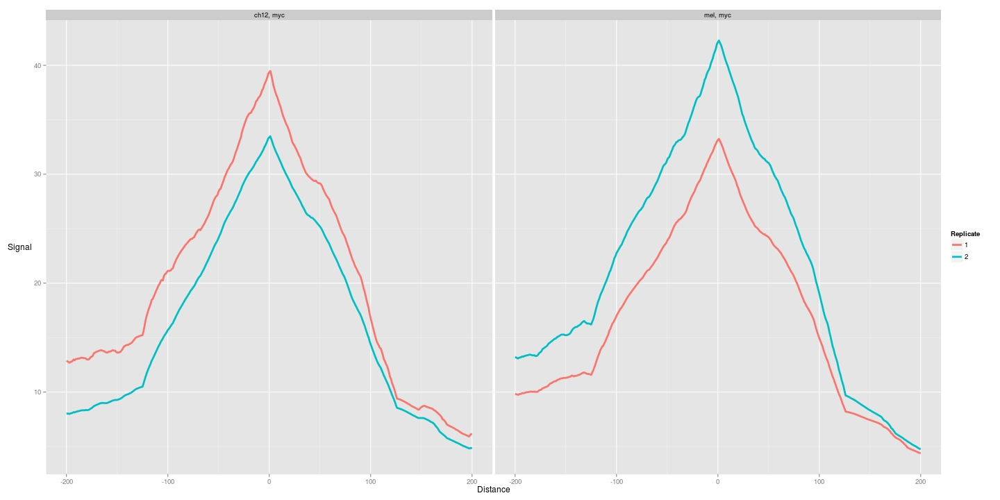

postPeakCallingQC
========================================================
author: MRC Clinical Sciences Centre
date:http://mrccsc.github.io/r_course/introToR_Session1.html
width: 1440
height: 1100
autosize: true
font-import: <link href='http://fonts.googleapis.com/css?family=Slabo+27px' rel='stylesheet' type='text/css'>
font-family: 'Slabo 27px', serif;
css:style.css
First Steps in Alignment


QC post peak calling
========================================================

```r
library(ChIPQC)
library(GenomeInfoDb)
```
Fixing differences in Genome Contig Annotation.2
========================================================
Lets check names of contigs in our BAMS

```r
myBL <- ChIPQC:::GetGRanges("/home/ubuntu//chipseqcourseData/referencedata/mm9-blacklist.bed")
myBL <- renameSeqlevels(myBL,gsub("chr","",seqlevels(myBL)))
```


We will also need to the same for gene annotation
========================================================
We can extract,alter and provide custom feature annotation for ChIPQC


```r
mm9Anno <- ChIPQC:::getAnnotation("mm9",AllChr=NULL)
mm9AnnoNew <- lapply(mm9Anno[-1],
                  function(x)
                  renameSeqlevels(x,gsub("chr","",seqlevels(x))
                       )
              )
```

Setting up ChIPQC the Diffbind way - Metadata
========================================================
So first we need valid samplenames and some metadata to attach 


 

```r
indexedBams <- dir("/home/ubuntu//chipseqcourseData/sortedbams/",
                   pattern="*sorted\\..*bam$",full.names=T)

SampleID <- c("myc_ch12_1","myc_ch12_2","myc_Mel_1","myc_Mel_2")
Tissue <- c(rep("ch12",2),rep("mel",2))
Treatment <- rep(NA,4)
Condition <- rep(NA,4)
Factor <- c(rep("myc",2),rep("myc",2))
Replicate <- c(1,2,1,2)
```
Setting up ChIPQC the Diffbind way - Alignment Files and Controls
========================================================


```r
bamReads  <- indexedBams[-c(3,6)]
bamControl= c("/home/ubuntu//chipseqcourseData/sortedbams//wgEncodeSydhTfbsCh12InputIggmusRawDatasorted.bam.bam",
              "/home/ubuntu//chipseqcourseData/sortedbams//wgEncodeSydhTfbsCh12InputIggmusRawDatasorted.bam.bam",
              "/home/ubuntu//chipseqcourseData/sortedbams//wgEncodeSydhTfbsMelInputIggmusRawDatasorted.bam.bam",
              "/home/ubuntu//chipseqcourseData/sortedbams//wgEncodeSydhTfbsMelInputIggmusRawDatasorted.bam.bam")
ControlID = c("ch12","ch12","MEL","MEL")
```

Setting up ChIPQC the Diffbind way - The Peak Files
========================================================


```r
Peaks <- dir("/home/ubuntu//chipseqcourseData/MacsPeaks/",full.names=T)
PeakCaller <- rep("macs",4)

ss <- data.frame(SampleID,Tissue,Factor,Treatment,Replicate,
                 Condition,bamReads,
                 bamControl,ControlID,
                 Peaks,
                 PeakCaller)
```

The sampleSheet and ChIPQC
========================================================
The Samplesheets specifies all the metadata and file information you would need for running ChIPQC


```r
ss[1,]
```

```
    SampleID Tissue Factor Treatment Replicate Condition
1 myc_ch12_1   ch12    myc        NA         1        NA
                                                 bamReads
1 wgEncodeSydhTfbsCh12CmycIggrabRawDataRep1sorted.bam.bam
                                                                                        bamControl
1 /home/ubuntu//chipseqcourseData/sortedbams//wgEncodeSydhTfbsCh12InputIggmusRawDatasorted.bam.bam
  ControlID
1      ch12
                                                            Peaks
1 /Users/tcarroll//chipseqcourse/MacsPeaks//mycch12rep1_peaks.xls
  PeakCaller
1       macs
```


Now we can run ChIPQC from samplesheet. Notice we set **consensus** and **bCount** to false.
This will stop DiffBind editing our peaks and performing a counting operation.


```r
res <- ChIPQC(ss,annotation=mm9AnnoNew,
              chromosomes=paste0(1:10),
              blacklist=myBL,consensus=F,bCount=F)
```
Now we can run through same metrics as before such as QCmetrics
========================================================
Now we have Frip scores


```r
QCmetrics(res)
```

```
              Reads Map%    Filt% Dup% ReadL FragL RelCC  SSD RiP% RiBL%
myc_ch12_1 10792905  100 0.00e+00    0    36   176 1.030 5.22 14.0  13.9
myc_ch12_2  9880785  100 0.00e+00    0    36   146 1.370 3.94 19.5  11.1
myc_Mel_1   9912979  100 0.00e+00    0    35   169 1.150 4.57 23.1  13.0
myc_Mel_2  10475318  100 0.00e+00    0    35   161 0.973 5.54 21.7  15.3
ch12       15907271  100 6.29e-06    0    36   180 0.744 7.76   NA  16.2
MEL        18437914  100 0.00e+00    0    35   173 0.444 8.61   NA  17.1
```

We can plotCC again
========================================================

```r
plotCC(res)
```

 

Get SSD
========================================================

```r
plotSSD(res)
```

 

Plot Reads in genomic regions
========================================================

```r
plotRegi(res)
```

 

Plot reads in Blacklists
========================================================

```r
plotFribl(res)
```

 

And finally plot our Frip scores
========================================================

```r
plotFrip(res)
```

 

And finally plot our peak profiles 
========================================================
 


Session Info
============================================


```r
sessionInfo()
```

```
R version 3.2.2 (2015-08-14)
Platform: x86_64-apple-darwin13.4.0 (64-bit)
Running under: OS X 10.11 (El Capitan)

locale:
[1] en_GB.UTF-8/en_GB.UTF-8/en_GB.UTF-8/C/en_GB.UTF-8/en_GB.UTF-8

attached base packages:
[1] stats4    parallel  stats     graphics  grDevices utils     datasets 
[8] methods   base     

other attached packages:
 [1] TxDb.Mmusculus.UCSC.mm9.knownGene_3.2.2
 [2] GenomicFeatures_1.22.5                 
 [3] AnnotationDbi_1.32.0                   
 [4] ChIPQC_1.6.1                           
 [5] DiffBind_1.16.1                        
 [6] RSQLite_1.0.0                          
 [7] DBI_0.3.1                              
 [8] locfit_1.5-9.1                         
 [9] GenomicAlignments_1.6.1                
[10] Rsamtools_1.22.0                       
[11] Biostrings_2.38.2                      
[12] XVector_0.10.0                         
[13] limma_3.26.3                           
[14] SummarizedExperiment_1.0.1             
[15] Biobase_2.30.0                         
[16] GenomicRanges_1.22.1                   
[17] GenomeInfoDb_1.6.1                     
[18] IRanges_2.4.4                          
[19] S4Vectors_0.8.3                        
[20] BiocGenerics_0.16.1                    
[21] ggplot2_1.0.1                          
[22] knitr_1.11                             

loaded via a namespace (and not attached):
 [1] edgeR_3.12.0           splines_3.2.2          gtools_3.5.0          
 [4] latticeExtra_0.6-26    amap_0.8-14            RBGL_1.46.0           
 [7] Category_2.36.0        lattice_0.20-33        digest_0.6.8          
[10] RColorBrewer_1.1-2     checkmate_1.6.3        colorspace_1.2-6      
[13] Matrix_1.2-2           plyr_1.8.3             GSEABase_1.32.0       
[16] chipseq_1.20.0         XML_3.98-1.3           pheatmap_1.0.7        
[19] ShortRead_1.28.0       biomaRt_2.26.1         genefilter_1.52.0     
[22] zlibbioc_1.16.0        xtable_1.8-0           GO.db_3.2.2           
[25] scales_0.3.0           brew_1.0-6             gdata_2.17.0          
[28] BiocParallel_1.4.0     annotate_1.48.0        proto_0.3-10          
[31] survival_2.38-3        magrittr_1.5           evaluate_0.8          
[34] systemPipeR_1.4.5      fail_1.3               MASS_7.3-45           
[37] gplots_2.17.0          hwriter_1.3.2          GOstats_2.36.0        
[40] graph_1.48.0           tools_3.2.2            formatR_1.2.1         
[43] BBmisc_1.9             stringr_1.0.0          sendmailR_1.2-1       
[46] munsell_0.4.2          lambda.r_1.1.7         caTools_1.17.1        
[49] futile.logger_1.4.1    grid_3.2.2             RCurl_1.95-4.7        
[52] rjson_0.2.15           AnnotationForge_1.12.0 bitops_1.0-6          
[55] base64enc_0.1-3        codetools_0.2-14       gtable_0.1.2          
[58] reshape2_1.4.1         Nozzle.R1_1.1-1        rtracklayer_1.30.1    
[61] futile.options_1.0.0   KernSmooth_2.23-15     stringi_1.0-1         
[64] BatchJobs_1.6          Rcpp_0.12.2           
```
